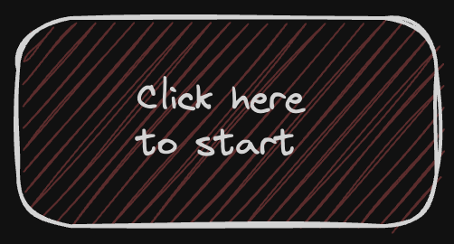

# Level Up: A 5-Level Challenge

*Click on the button above to get started straight away!*

# Introduction

Welcome to "Level Up," an engaging repository designed for our unique Monthly 5-Level Challenge called a Mission. This initiative is more than just a challenge; it's a journey to elevate your skills and knowledge in the company of like-minded peers. Each Mission, consisting of 5 levels, focuses on three core aspects to accelerate your coding expertise: Web3 Fundamentals, Syntax & a Final Assignment.

# Our Goal

The primary goal of "Level Up" is to enhance your skills and knowledge in a structured. By participating, you join a community of enthusiastic developers, all striving to grow together. This is your opportunity to improve individually and contribute to and benefit from the collective wisdom of a supportive and like-minded crew.

# Challenge Focuses

## Mastering DeFi

- **Objective**: Learn about the fundamentals through various videos and articles. You'll be able to use this time to get the bigger picture.
- **Activities**: Review articles and videos for a deeper understanding of lending.

## Mastering Syntax

- **Objective**: Deepen your understanding and application of programming language syntax.
- **Activities**: Review the basics of Solidity, powered by Cyfrin's course.

## Final Assignment

- **Objective**: Gain mastery over Foundry and build out that Contract!
- **Activities**: Overview of necessary Foundry commands and instructions to build out the Contract.

# Participation

## How to Join

- Join the TG Channel: [https://t.me/protocolexplorer](https://t.me/protocolexplorer)
- Start the challenge by following instructions in each Level
- Submit your deployed contracts (tg group for submissions or Twitter)

## Rules and Guidelines

- Complete each challenge within two weeks.
- These are individual assignments, but collaboration is highly encouraged.
- For all announcements, join this channel: [https://t.me/protocolexplorer](https://t.me/protocolexplorer)
- For discussions, join this Telegram group: [https://t.me/+5mW5gsUKqxQ5ZGYx](https://t.me/+5mW5gsUKqxQ5ZGYx)
- Share your journey, insights, and achievements using the Telegram group or Twitter.
- If you would like us to echo your achievements, feel free to tag us: @razacodes @rahatcodes @tonyolendo.

# Resources

You can find specific resources under each challenge!

# Feedback and Contributions

Developers! If you spot something that needs fixing or have a great idea to enhance our challenges, please submit a pull request. Your contributions make a big difference.

We Value Your Ideas! Your suggestions and improvements are essential for our growth. If you see an opportunity for us to improve, don't hesitate to share your thoughts.

We are growing Together. Every bit of feedback and each contribution helps us all improve. Let's keep supporting each other and celebrating our collective progress.

# License

This project is under MIT-License. For more details, see the LICENSE file.
