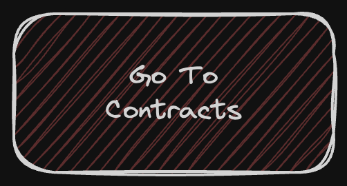

# Solidity Syntax Guide for Smart Contract Development

Still. not. a. course.
This guide gives you an overview of the syntax used in the contract at this level.

If anything feels unfamiliar or you feel uncomfortable with a specific concept, that's your cue to go back to the [Cyfrin course](https://updraft.cyfrin.io/courses/solidity).

Secondly, we developed a bleeding-edge tool powered by AI that will help you master syntax...ok, not exactly.

We've built this training module that has random Solidity exercises. It is in beta, but it's meant to give you exercises where you can do some dumb practice.

To become more comfortable with the syntax, head to [Protocol Explorer](https://www.protocolexplorer.com/exercises).

ps. If you want to help us make this training module better, slide in our dms!
## Table of Contents

1. **Solidity Version Pragma**
2. **Import Statement**
3. **Contract Declaration**
4. **State Variables**
5. **Mappings**
6. **Constructor**
7. **Functions**
8. **External Keyword**
9. **Require Statements**
10. **ERC20 Token Interface**
11. **Transferring Tokens**
12. **Error Handling**

---

### 1. Solidity Version Pragma
Specifies the Solidity compiler version, ensuring compatibility and stability.
```solidity
pragma solidity ^0.8.7;
```

### 2. Import Statement
Incorporates external code, like interfaces or libraries, into the contract.
```solidity
import "@openzeppelin/contracts/token/ERC20/IERC20.sol";
```

### 3. Contract Declaration
Begins the definition of the smart contract.
```solidity
contract TokenLending {
    // Contract contents
}
```

### 4. State Variables
Persistent variables that store contract data on the blockchain.
```solidity
IERC20 public token;
```

### 5. Mappings
Data structures for associating keys with values, used for tracking token balances and borrowed amounts.
```solidity
mapping(address => uint256) public tokenBalances;
mapping(address => uint256) public borrowedAmounts;
```

### 6. Constructor
Initializes the contract's state, executed at the time of contract deployment.
```solidity
constructor(address tokenAddress) {
    token = IERC20(tokenAddress);
}
```

### 7. Functions
Contains the main logic of the contract, defining various operations like depositing and withdrawing tokens.
```solidity
function depositToken(uint256 amount) external {
    // Code for depositing tokens
}
```

### 8. External Keyword
Marks functions as callable only from outside the contract.
```solidity
function borrowToken(uint256 amount) external {
    // Borrow token logic
}
```

### 9. Require Statements
Asserts conditions, reverting the transaction if they fail.
```solidity
require(tokenBalances[msg.sender] >= amount, "Insufficient token balance");
```

### 10. ERC20 Token Interface
The standardized interface for ERC20 tokens, facilitating interactions with ERC20-compliant tokens.
```solidity
IERC20 public token;
```

### 11. Transferring Tokens
Operations related to moving ERC20 tokens to and from the contract.
```solidity
token.transfer(msg.sender, amount);
```

### 12. Error Handling
Manages errors and ensures transactions are valid and conditions are met.
```solidity
require(borrowedAmounts[msg.sender] >= amount, "Repay amount exceeds borrowed amount");
```
[](./Final-Assignment/Readme.md)
---