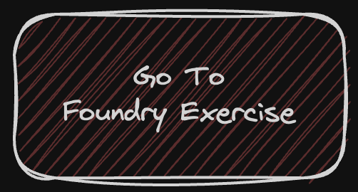
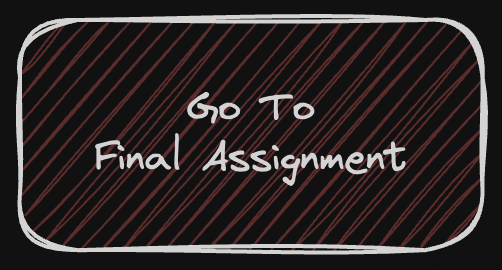

## Collateralized Lending Contract Practice Repository
You've grasped the fundamentals and honed your syntax skills. 
Now, it's time to put your Foundry expertise to the test and build the contract.

** *Remember, this is not a course* **

If you need a refresher on Solidity basics, consider revisiting the Cyfrin Solidity Fundamental's course.

In this final assignment, we'll guide you through understanding and constructing a Collateralized Lending smart contract using Foundry. This repository is designed for both newcomers and seasoned developers in Ethereum and smart contracts, offering a structured approach to enhancing your development skills.

<!-- **Start with Foundry exercises (CLICK BELOW TO BEGIN)**

 -->

**Ready for the challenge? Proceed to the Final Assignment 👇**

## Repository Structure
<!--  -->

The repository is structured into 2 primary directories:

1. **Final Assignment**: Your starting point for creating a Foundry project from scratch and building the Collateralized Lending contract. If you need assistance setting up your Foundry project, refer to `Foundry-Exercise.md`.

2. **Assignment-Hint**: If you're stuck or seeking guidance, this folder offers hints to aid in the effective construction of your contract.

## Step-by-Step Guide
### Step 1: Final Assignment
- **Objective**: Begin the development of your Collateralized Lending contract.
- **Action**: Navigate to the `Final Assignment` directory. Here, you'll initiate a Foundry project and start crafting your smart contract. This stage is your chance to apply your accumulated knowledge and build the Collateralized Lending contract from scratch.

### Step 2: Assignment-Hint
- **Objective**: Obtain help for any challenges faced.
- **Action**: Should you require assistance or a hint to move forward, the `Assignment-Hint` folder is your resource. It contains valuable tips to help you navigate through the more intricate aspects of contract development.

## Conclusion

This practice repository is a comprehensive platform for anyone keen on smart contract development, especially in the realm of building and testing a Collateralized Lending contract. By engaging with these steps, you'll gain practical experience with Foundry, contract development, and testing within the Ethereum ecosystem. Happy coding!
