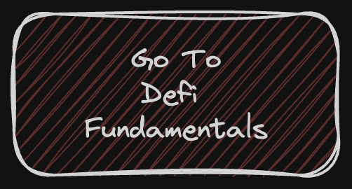

# 🚀 Level 3: Master Collateralized Lending! 🌟
Welcome to Level 3!

Advance your journey in DeFi lending with this deep dive into collateralized lending mechanisms. Building upon your knowledge of ERC20 tokens from Level 2, you're now stepping into the more complex world of lending with collateral. In real-world DeFi platforms, lending often involves collateral to secure loans. Ready to take your DeFi expertise to the next level?

Let's embark on this advanced phase! 💪

## High level structure
**1. START WITH THE FUNDAMENTALS(CLICK BELOW)**

**2. MOVE ON TO THE SYNTAX**

**3. FINISH WITH THE CONTRACTS**

1. DeFi Fundamentals: Begin your journey in the readings directory. Here, you'll deepen your understanding of collateralized lending in DeFi.

2. Syntax: Next, head over to the syntax directory to refine your Solidity programming skills for handling collateralized loans. This section is crucial for mastering complex contract development.

3. Assignment: Finally, advance to the Assignment directory. Challenge yourself by creating and deploying a collateralized lending contract with Foundry.

### Navigating Each Section
In each section, you will find instructions on how to tackle that particular activity:

1. For DeFi Fundamentals: Dive into readings that provide context and advanced knowledge on collateralized DeFi lending.
2. Syntax: This section will equip you with all the syntax and techniques needed to create a collateralized lending contract, linking to relevant advanced lectures.
3. Contracts: Detailed instructions in every contract's directory guide you through building a collateralized lending contract for this level of complexity.

## Challenge Levels

### Level 3: Master Collateralized Lending!

#### 📚 `DeFi_Guide`
**Objective**: Deepen your understanding of collateralized DeFi lending. Grasp the advanced concepts that are fundamental to secured lending platforms.
- Learn about the role of collateral in DeFi, different types of collateral, and the mechanics of liquidation.
- This directory contains in-depth materials that cover all aspects of collateralized lending in DeFi.

#### 💻 `Syntax`
**Objective**: Enhance your Solidity skills for complex contract scenarios. Solidity is crucial for developing sophisticated and secure smart contracts.
- Advance your understanding of Solidity with a focus on functions, mappings, and state variables relevant to collateralized lending.
- This folder is filled with challenging exercises and examples to elevate your coding expertise.

#### 🔧 Directory: `Final Assignment`
**Objective**: Apply your knowledge in a practical setting. Build a sophisticated Collateralized Lending Contract using Foundry!
- Start from the basics and progress to a fully functional collateralized lending smart contract.
- Follow the instructions within the directory to set up your environment, write your contract, and rigorously test it.

## How to Succeed in This Challenge 🌟

1. **Deepen Your Understanding**: The complexities of collateralized lending require thorough understanding. Take your time to fully grasp these advanced concepts.
2. **Practice Advanced Syntax**: Solidify your Solidity skills with a focus on collateral handling. Experiment with different coding techniques and tackle the challenging exercises.
3. **Hands-On Learning**: The best way to learn is by doing. Constructing a contract from the ground up will cement your understanding and provide invaluable experience.
4. **Seek Support When Necessary**: If you're stuck, that's okay! Reach out in the telegram group, or revisit the `DeFi_Guide` and `syntax` directories for guidance.
5. **Enjoy the Learning Journey**: Remember, advancing your skills is a journey of discovery and achievement. Celebrate each step forward and stay motivated.

## Conclusion

This challenge is more than learning; it's about becoming a proficient participant in the DeFi space. By the end of this challenge, you'll have not only a deep understanding of collateralized DeFi lending but also practical experience in building a sophisticated lending contract. Are you ready to take on this challenge and emerge as a DeFi expert? Let's do this! 🚀🌟

Embrace this challenge with enthusiasm, and let's push the boundaries of decentralized finance together! 💥💼📈
