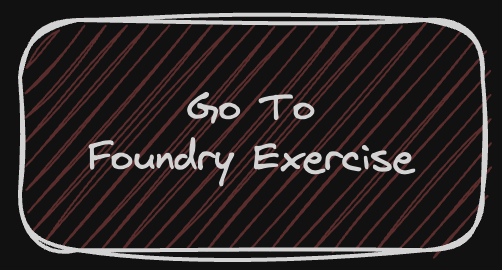

## Advanced Lending Contract Practice Repository
You've mastered the fundamentals and refined your syntax skills. 
Now, it's time to elevate your Foundry expertise and tackle an advanced contract.

** *Remember, this is a hands-on learning journey* **

If you need to brush up on Solidity basics, feel free to revisit the Cyfrin Solidity Fundamental's course.

In this final assignment, we'll guide you through the process of understanding and constructing an Advanced Lending smart contract using Foundry. This repository is tailored for both newcomers and experienced developers in Ethereum and smart contracts, providing a structured path to mastering advanced development skills.

<!-- **Begin with Foundry exercises (CLICK BELOW TO START)**

 -->

**Ready to face the challenge? Move on to the Final Assignment 👇**

## Repository Structure
<!--  -->

The repository is organized into 2 main directories:

1. **Final Assignment**: This is where you'll embark on creating a Foundry project from the ground up and build the Advanced Lending contract. For help setting up your Foundry project, refer to `Foundry-Exercise.md`.

2. **Assignment-Hint**: Stuck or in need of some guidance? This folder contains hints to assist you in effectively constructing your advanced lending contract.

## Step-by-Step Guide
### Step 1: Final Assignment
- **Objective**: Start building your Advanced Lending contract.
- **Action**: Head to the `Final Assignment` directory. Here, you'll kick off a Foundry project and begin the development of your smart contract. This is your opportunity to apply what you've learned and construct the Advanced Lending contract from the ground up.

### Step 2: Assignment-Hint
- **Objective**: Seek assistance for any encountered challenges.
- **Action**: If you find yourself needing a bit of help or a nudge in the right direction, the `Assignment-Hint` folder is your go-to resource. It contains useful hints that can guide you through complex parts of the advanced contract development.

## Conclusion

This practice repository offers a comprehensive learning experience for anyone interested in smart contract development, particularly in the realm of building and testing an Advanced Lending contract. By following these steps, you'll gain hands-on experience with Foundry, contract development, and testing in the Ethereum ecosystem. Happy coding!
